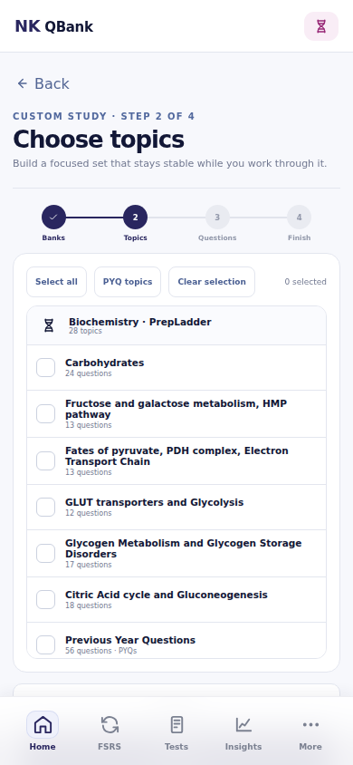
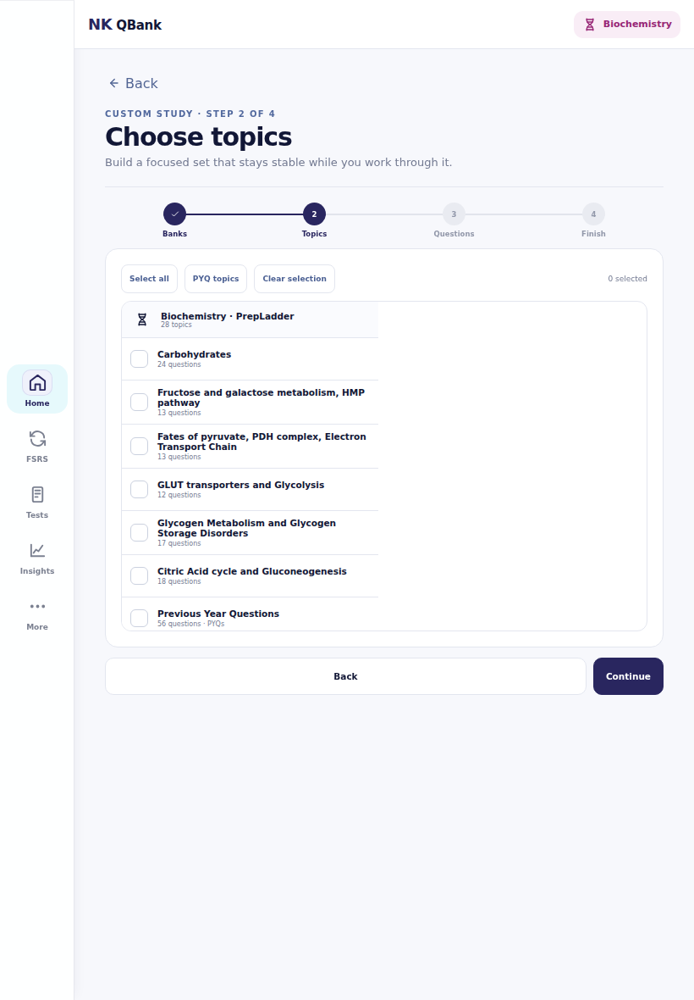
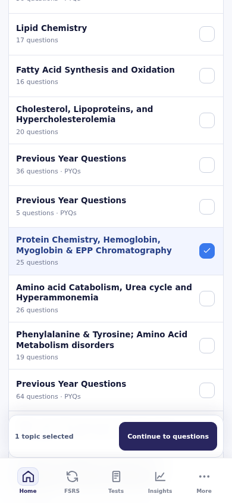
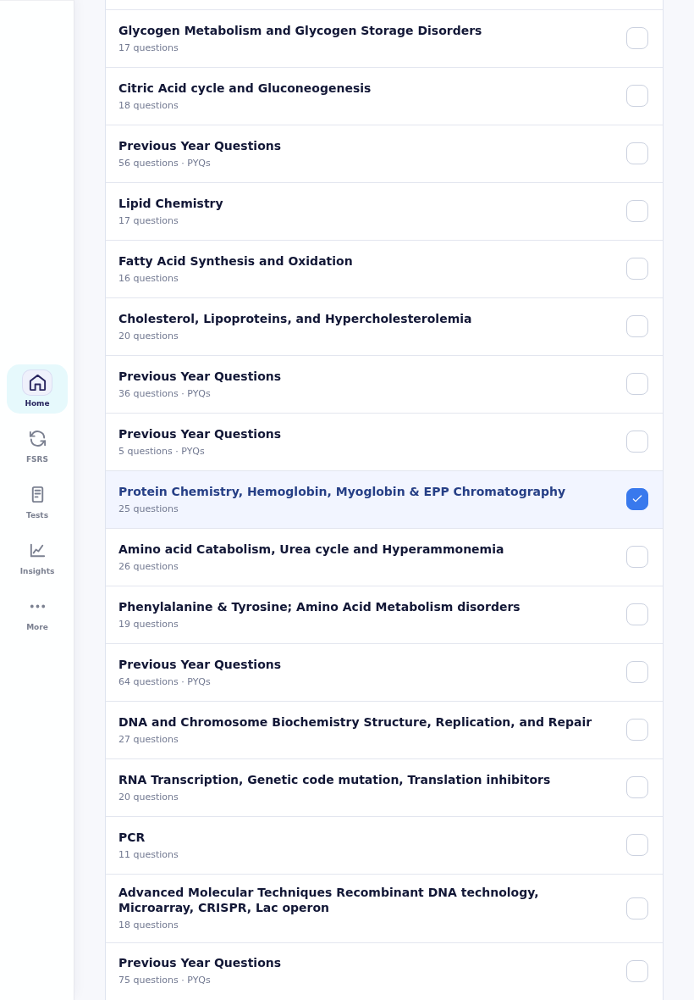

# Custom module topic picker audit — 2026-09-25

Source: fresh `study-ui-audit` screenshots from full build run
[36095684713](https://github.com/Numankhan2013/V10.1/actions/runs/36095684713),
head `d34ce8c`. Viewports: 390 × 844 phone and 820 × 1180 tablet.
The screenshots show an empty local learner state at step 2. They do not
establish physical Android touch behavior.

## Step 1 — Choose banks: acceptable

The subject and bank cards are understandable, and the selected bank carries
forward. Their small secondary labels were increased for readability. This
step was not the primary source of friction.

## Step 2 — Choose topics: broken before this change

- The 390px-high nested scroll pane shows only seven of 28 Biochemistry topics
  on the phone. Scrolling anywhere outside its narrow bounds moves the page,
  not the list.
- A row is 50px high, with a 10.5px title and 8px metadata. The tablet uses
  only part of the available row width.
- Selecting any topic calls the full app `render()`, replacing the list and
  losing the user's position. The bottom Continue action sits below the phone
  viewport.

The fix makes topics part of ordinary page scrolling, adds a live search,
enlarges the complete row target and text, shows per-bank selected counts,
offers a one-tap bank selection when multiple banks are chosen, and updates
selections in place. A persistent Continue action shows the number selected
and stays above the bottom nav.

These after captures are from the 390px/820px browser run
[36098725634](https://github.com/Numankhan2013/V10.1/actions/runs/36098725634).
The run also captured the initial 320px and larger-text states. A final small
cleanup hides the per-bank action when only one bank is selected; it does not
change the rows pictured above.

## Step 3 — Build question pool: usable, cramped

The five pool choices and PYQ source filter remain intact. Their labels,
descriptions, count controls, and scope links are enlarged. The duplicate
bottom Back button is removed; the top Back button remains.

## Step 4 — Name and create: usable, duplicate navigation

Save for later and Start now remain the two final actions. The duplicate
bottom Back button is removed and review text is enlarged.

## Reference decisions

- [AMBOSS Qbank session help](https://support.amboss.com/hc/en-us/articles/360032477132-Creating-a-Qbank-session)
  allows searching within filters for specific items. Search is the main
  inspiration for selecting a few chapters from a large bank.
- [PrepLadder custom module help](https://www.prepladder.com/help-center/prepladder-modules/how-to-create-test-or-qbank-practise-module)
  keeps bank/subject choice, topic or tag choice, question preferences and
  creation as deliberate stages. The current four-step builder preserves that
  sequence.

## Verification

The browser capture checks a deep topic tap without a scroll jump, live search,
the removal of nested scrolling, full tablet row width, a visible phone
Continue action, and completion of the existing module and PYQ journeys.
The final candidate additionally checks that single-bank modules do not show
a duplicate group action and that per-bank selection works with two banks.
Exact-head full build and physical Android review must be checked separately.
